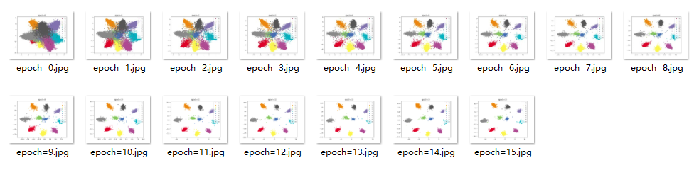
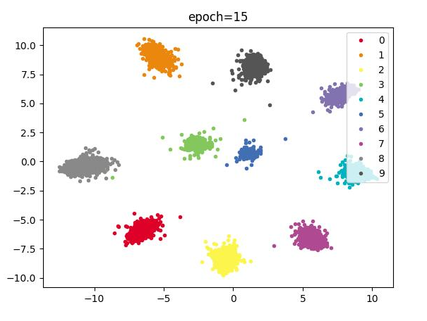
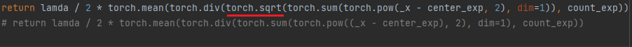
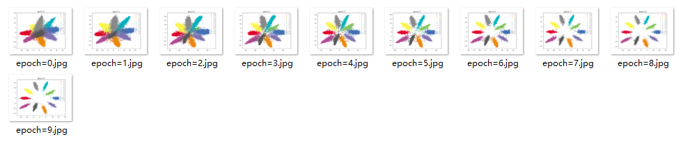
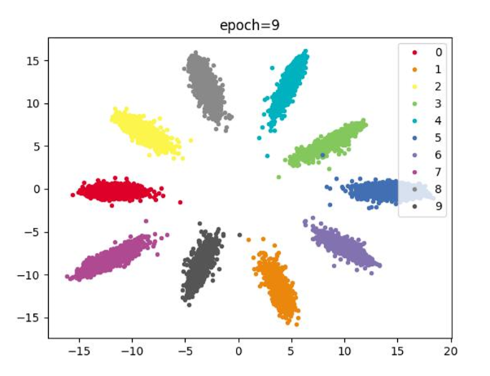
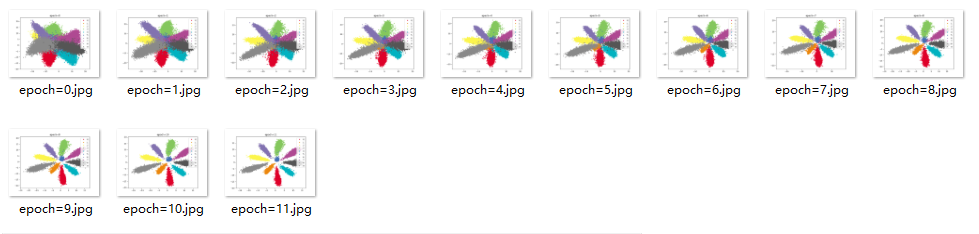
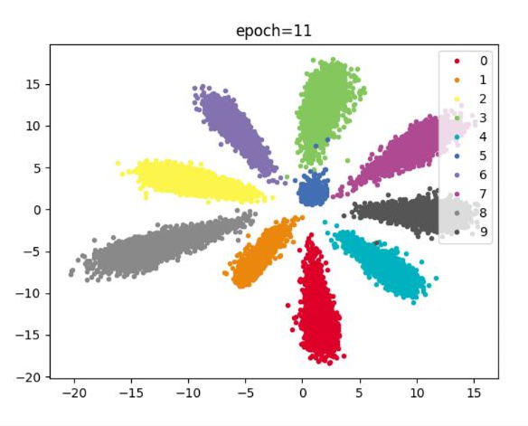

# CenterLoss实现
以MNIST数据集为例，分类模型采用交叉熵损失函数，距离损失使用不带根号版的CenterLoss，收敛速度极快
> 参考文章：[史上最全MNIST系列（三）——Centerloss在MNIST上的Pytorch实现（可视化）](https://www.codenong.com/cs106713478/)


## V1.0
### 中心损失（取消根号版）
```python
return lamda / 2 * torch.mean(torch.div(torch.sum(torch.pow((_x - center_exp), 2), dim=1), count_exp))
```
### 网络结构
```python
self.hidden_layer = nn.Sequential(
    ConvLayer(1, 32, 5, 1, 2),
    ConvLayer(32, 64, 5, 1, 2),
    nn.MaxPool2d(2, 2),
    ConvLayer(64, 128, 5, 1, 2),
    ConvLayer(128, 256, 5, 1, 2),
    nn.MaxPool2d(2, 2),
    ConvLayer(256, 512, 5, 1, 2),
    ConvLayer(512, 512, 5, 1, 2),
    nn.MaxPool2d(2, 2),
    ConvLayer(512, 256, 5, 1, 2),
    ConvLayer(256, 128, 5, 1, 2),
    ConvLayer(128, 64, 5, 1, 2),
    nn.MaxPool2d(2, 2)
)

self.fc = nn.Sequential(
    nn.Linear(64, 2)
)

self.output_layer = nn.Sequential(
    nn.Linear(2, 10)
)
```
### 参数
```python
data_loader = data.DataLoader(dataset=train_data, shuffle=True, batch_size=256)
# ...
net_opt = torch.optim.SGD(net.parameters(), lr=0.001, momentum=0.9)
scheduler = torch.optim.lr_scheduler.StepLR(net_opt, 20, gamma=0.8)
c_l_opt = torch.optim.SGD(center_loss_fn.parameters(), lr=0.5)
```
### 效果



## V1.1
V1.0基础上，中心损失恢复根号，其余条件不变


### 中心损失（带根号版）
```python
return lamda / 2 * torch.mean(torch.div(torch.sqrt(torch.sum(torch.pow(_x - center_exp, 2), dim=1)), count_exp))
```
### 效果



### 结论
不带根号-->带根号centerloss计算，不带根号的损失计算，让模型分类收敛更快
## V1.2
V1.1基础上，网络结构减少，其余条件不变
### 网络结构
```python
self.hidden_layer = nn.Sequential(
    ConvLayer(1, 32, 5, 1, 2),
    ConvLayer(32, 64, 5, 1, 2),
    nn.MaxPool2d(2, 2),
    ConvLayer(64, 128, 5, 1, 2),
    ConvLayer(128, 256, 5, 1, 2),
    nn.MaxPool2d(2, 2),
    ConvLayer(256, 512, 5, 1, 2),
    ConvLayer(512, 512, 5, 1, 2),
    # nn.MaxPool2d(2, 2),
    # ConvLayer(512, 256, 5, 1, 2),
    # ConvLayer(256, 128, 5, 1, 2),
    # ConvLayer(128, 64, 5, 1, 2),
    nn.MaxPool2d(2, 2)
)

self.fc = nn.Sequential(
    nn.Linear(512 * 3 * 3, 2)
    # nn.Linear(64, 2)
)

self.output_layer = nn.Sequential(
    nn.Linear(2, 10)
)
```
### 效果



### 结论
更深的网络层数，收敛速度更快

